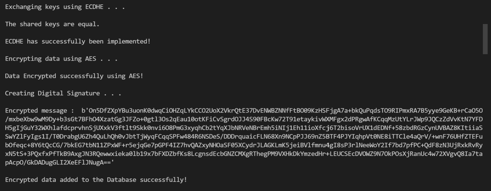
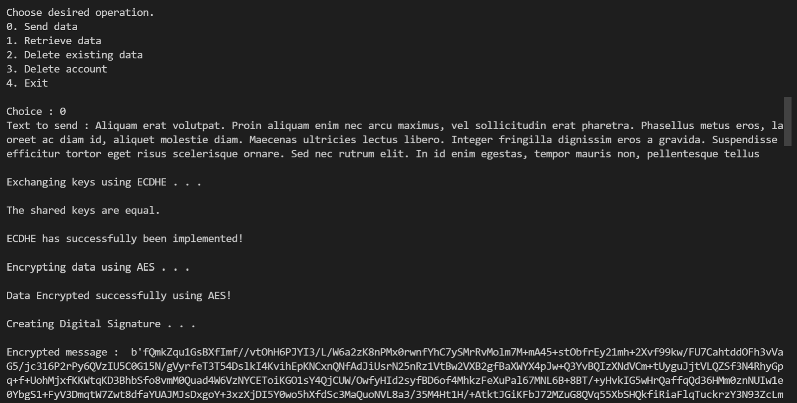
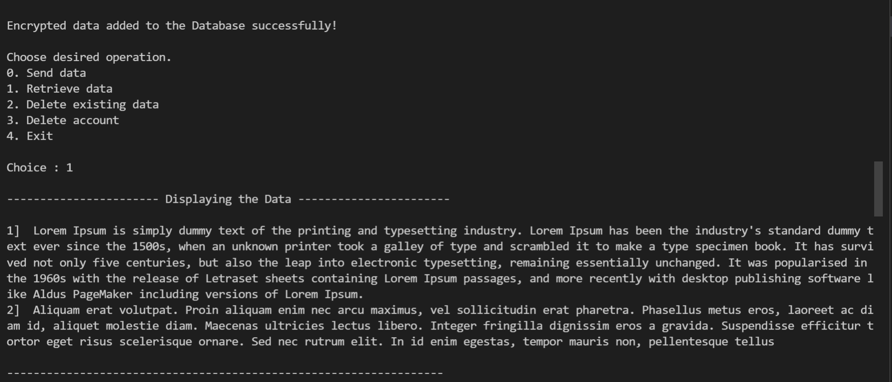
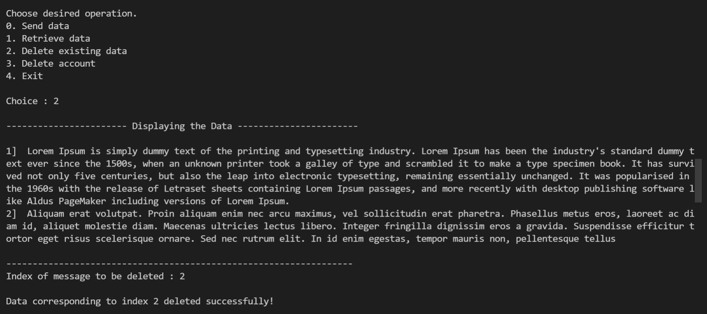
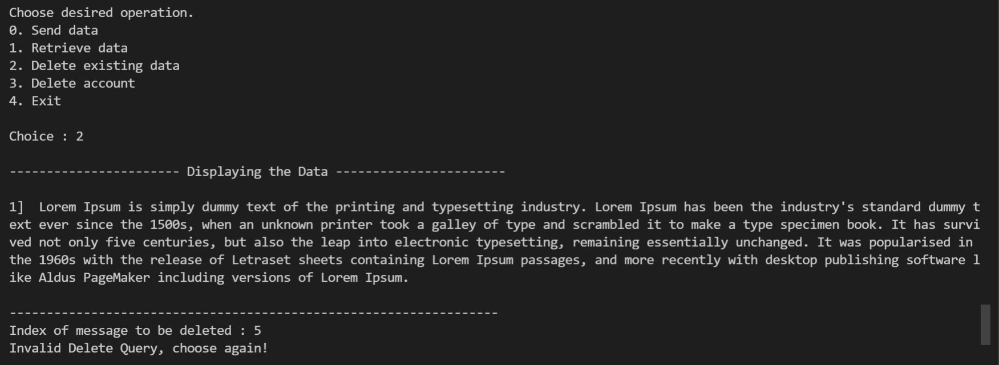
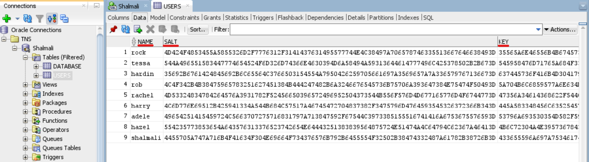
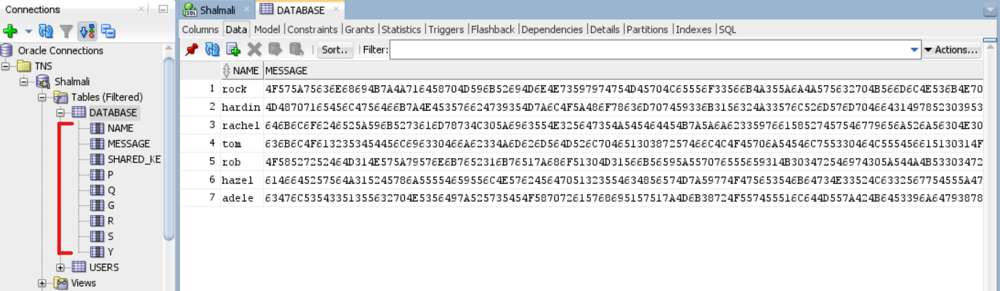

## Securing Transmission and Data Storage to Mitigate Man-in-the-middle Attack

### Okay, but why do we need to secure a *Database*?

In today’s data-driven world, data breaches can affect hundreds of millions or even billions of people at a time. 
For example, in January 2020, over 250 million Microsoft customer records and their personal details were leaked online. A similar database was leaked of Zoom in March, where details of 500,000 accounts were available for sale on the dark web. These leaks were only possible because the information stored in the databases wasn't secure enough.

Securing the `Transmission` is equally important as securing the `Database`, if not more. The proposed work aims at providing a method to transfer data safely and securely between the user and store it in the database without the interference of hackers during transmission of data between user and database and vice-versa. Every data stored in the database is encrypted, providing no room for the hacker to get hold of user credentials and information. 

###  <ins>**Cryptographic Algorithms used:**  
  1. **ECDHE** :  
For the data transmission, Elliptic Curve Diffie Hellman Ephemeral key exchange protocol is implemented. As the public key has been exposed, no party including any hacker can determine the private key as the security of private key lies in solving the discrete logarithm problem which is computationally impossible calculate, thus preventing MITM attacks. The shared key thus generated is used as the Key for AES-encryption.  
  2. **AES - 128** :   At its peak, the Bitcoin network - arguably the largest modern use of computational power for cryptography - performed approximately 2^67 operations per second. To put that in perspective, it would take the Bitcoin network over 70,000,000,000,000,000,000,000,000 years to crack a single AES-128 key. To make the resulting cipher less vulnerable to frequency analysis attack, CBC mode is used.   
  3. **Digital Signature Algorithm** : 
After encrypting the message, we authenticate it by creating a Digital Signature. This is necessary to avoid tampering and digital modification or forgery during the transmission.  
  4. **SHA - 256 and Salting** : 
Hashed passwords are irreversible and scrambled, yet they remain susceptible to brute-force attacks and rainbow table attacks. Salts gain their power by being unique to the entry, not by being secret, therefore a unique 32 byte salt is created for each user. SHA-256 is used because it doesn’t have any known vulnerabilities that make it insecure and it has not been “broken” unlike some other popular hashing algorithms.

###  <ins>**Features:**
1. Created a Login and Sign-up function, where username of each user is unique for efficient access of data. 
2. Instead of storing the password as plain-text, the password is first salted randomly (to prevent rainbow table attacks) and then hashed. This salt and hash of password is stored in user database. 
3. After logging in, users can send or retrieve data securely from database. Additional functionalities like Delete message and Delete user account are added. 
 
  
---
  
### <ins>**Sample Input-Output :**
  1. A user named Oliver, has signed up successfully. And the text is sent to the database. 
    

  2. Using ECDHE, a shared key is generated and this is used as a key for AES-encryption. After encryption, the digital signature is     created. 
    
    

  3. Data is being retrieved from the database (DSA Verification -> AES decryption -> Data) :  
    

  4. Deleting the data at index 2 from the database :  
    

  5. Deleting an message that does not exist :  
    

  6. Deleting user account :  
    

  7. User Database :  
    

  8. Message Database :  
    

###  <ins>**Improvements:**
  1. The storage database can be optimized by using better algorithms. 
  2. Number of bits used in Digital Signature Algorithm can be increased while keeping the Time Complexity low. 
  3. Storage of files can be implemented.  

